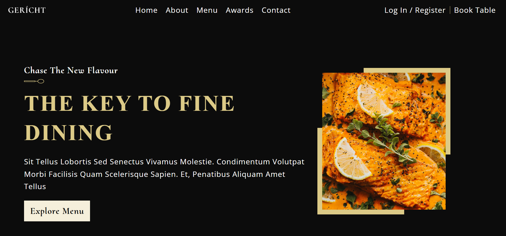

# 🍽️ Restaurant Website using ReactJS

A beautifully crafted and fully responsive **Restaurant Website** built with **ReactJS**. This project is ideal for showcasing a food brand online with sections like menu, about, contact, and hero banner — all designed with a modern aesthetic.

## 🚀 Live Demo

👉 [Live App](https://restaurent-react-website.vercel.app/)

## 🛠️ Tech Stack

- **ReactJS**
- **JavaScript (ES6+)**
- **CSS / Tailwind CSS or custom styling**

## ✨ Features

- Responsive restaurant landing page
- Reusable React components
- Smooth scrolling and layout transitions
- Menu, About, Hero, and Contact sections
- Clean and elegant UI/UX design

## 📚 Ideal For

- Front-End Projects
- Food Brand Websites
- Restaurant Marketing Pages
- Responsive React UI Practice

## 📫 Contact Me

- **📧 Email:** muhdzaheermv@gmail.com  
- **🔗 Portfolio:** [https://portfolio-lilac-eight-60.vercel.app/](https://portfolio-lilac-eight-60.vercel.app/)  
- **💼 LinkedIn:** [https://www.linkedin.com/in/muhammed-zaheer-836132244/](https://www.linkedin.com/in/muhammed-zaheer-836132244/)

## ⭐ Like This Project?

If this design inspired you or helped in your learning, give it a **⭐ star** — your support keeps me building!

